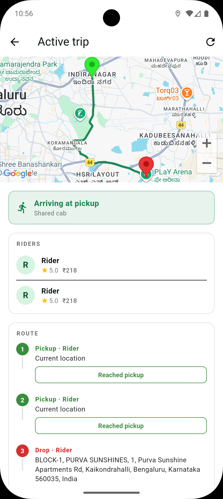

<p align="center">
  
</p>

<h1 align="center">ShareCab</h1>

<p align="center">
  Share the cab, split the fare, and coordinate the ride with confidence.
</p>

<p align="center">
  <a href="./app">Rider App</a> ·
  <a href="./driver">Driver App</a> ·
  <a href="./backend">Backend</a> ·
  <a href="./website">Website</a> ·
  <a href="./docs">Docs</a>
</p>

ShareCab is a full-stack cab-sharing platform for short city trips and airport pickup flows. It matches riders with nearby pickup and drop points, forms shared rides when the route makes sense, and gives drivers a clear pickup sequence with OTP verification.

The product is designed around a simple premise: many riders are already travelling in the same direction, but separate cab bookings make each trip more expensive and less efficient. ShareCab coordinates those compatible riders into one ride, splits the fare, and keeps the experience structured through matching rules, unlock gates, realtime trip state, chat, payment, ratings, and driver dispatch.

---

## Product Preview

<table>
  <tr>
    <td align="center" width="25%">
      <br>
      <sub>Phone login</sub>
    </td>
    <td align="center" width="25%">
      <br>
      <sub>Plan a ride</sub>
    </td>
    <td align="center" width="25%">
      <br>
      <sub>Choose match mode</sub>
    </td>
    <td align="center" width="25%">
      <br>
      <sub>Unlock a match</sub>
    </td>
  </tr>
  <tr>
    <td align="center" width="25%">
      <br>
      <sub>Pickup OTP and fare</sub>
    </td>
    <td align="center" width="25%">
      <br>
      <sub>Live rider state</sub>
    </td>
    <td align="center" width="25%">
      <br>
      <sub>Driver dispatch</sub>
    </td>
    <td align="center" width="25%">
      <br>
      <sub>Active trip route</sub>
    </td>
  </tr>
</table>

---

## What ShareCab Delivers

**For riders**

- Find a cab-share match for short city trips and airport pickup flows.
- Match with riders whose destinations are nearby, typically within a configurable **2-4 km radius**.
- Compare shared and solo ride options before committing.
- Unlock serious matches through ads or payment so low-intent requests do not flood the system.
- Confirm pickup with an OTP, chat with the group, track trip status, and rate the experience.

**For drivers**

- Go online, receive dispatches, view rider pickup details, and manage the active trip lifecycle.
- Use pickup OTP verification before starting a ride.
- Keep access controlled through driver subscription and onboarding flows.

**For the platform**

- Run matching, fare calculation, dispatch, authentication, payments, realtime updates, and notifications from one backend.
- Tune matching rules such as pickup radius, destination radius, detour limits, cab capacity, and luggage constraints.

---

## How The Ride Flow Works

1. A rider enters pickup, destination, luggage, and sharing preferences.
2. The backend searches for compatible riders near the same route corridor.
3. ShareCab proposes a shared match when pickup distance, destination distance, detour, vehicle capacity, and luggage rules are acceptable.
4. The rider unlocks or accepts the match, then receives driver, vehicle, fare, chat, and pickup OTP details.
5. The driver accepts the dispatch, verifies pickup OTPs, and progresses the trip through completion.
6. Riders pay, rate the trip, and keep their account session through phone OTP authentication.

---

## Platform Architecture

| Area | Responsibility |
|---|---|
| Rider app | Phone login, trip planning, matching preferences, unlocks, ride confirmation, chat, payment, live trip state. |
| Driver app | Subscription state, online/offline dispatch mode, incoming trips, pickup sequencing, OTP verification, active route state. |
| Backend API | Auth, matching, fare calculation, trip lifecycle, dispatch, payments, unlocks, realtime updates, persistence. |
| Website | Public product site, pricing, safety, driver information, support, and company pages. |

---

## Repository Structure

```
ShareCab/
|-- website/    # Next.js marketing and info website
|-- app/        # Flutter rider app
|-- driver/     # Flutter driver app
|-- backend/    # Node.js + Express API, matching engine, and realtime services
|-- docs/       # Cross-cutting product, architecture, deployment, and API docs
`-- README.md
```

| Part | Stack | Purpose |
|---|---|---|
| [website/](./website/) | Next.js App Router + Tailwind | Public ShareCab website. |
| [app/](./app/) | Flutter | Rider app: phone login, ride planning, matching, unlocks, chat, payment, trip status. |
| [driver/](./driver/) | Flutter | Driver app: onboarding, online status, dispatch acceptance, pickup OTP, active trip flow. |
| [backend/](./backend/) | Node.js + Express + MongoDB | REST and WebSocket API, auth, matching, dispatch, fare logic, payments, notifications. |

---

## Documentation

Start with **[docs/](./docs/)** for cross-cutting context: architecture, deployment, API, and runbook.

| If you are… | Read |
|---|---|
| A new engineer | [docs/architecture.md](./docs/architecture.md) → [docs/getting-started.md](./docs/getting-started.md) |
| Shipping to production | [docs/deployment.md](./docs/deployment.md) → [docs/runbook.md](./docs/runbook.md) |
| Integrating against the API | [docs/api.md](./docs/api.md) → [backend/docs/api.md](./backend/docs/api.md) |
| Curious about the product | [docs/product.md](./docs/product.md) |

Per-service deep dives live alongside the code: [backend/docs/api.md](./backend/docs/api.md), [app/docs/notifications.md](./app/docs/notifications.md).

---

## Community and Source Availability

ShareCab is public-source/source-available, not MIT-licensed and not OSI-approved open source. The code is available for transparency, review, learning, and noncommercial collaboration while commercial app, service, and production ride-hailing use remains reserved for the official ShareCab project unless separately licensed.

Key project policies:

- [License](./LICENSE.md)
- [Contribution guidelines](./CONTRIBUTING.md)
- [Contributor license terms](./CONTRIBUTOR_LICENSE_TERMS.md)
- [Code of conduct](./CODE_OF_CONDUCT.md)
- [Security policy](./SECURITY.md)
- [Support policy](./SUPPORT.md)
- [Governance](./GOVERNANCE.md)
- [Trademark policy](./TRADEMARKS.md)
- [Public repository boundaries](./docs/OPEN_SOURCE.md)

---

## Quick Start

Each app has its own setup details, but the full local stack can be started from the service folders:

```bash
# 1. Backend
cd backend && npm install && npm run dev    # http://localhost:4000

# 2. Rider app
cd app && flutter pub get && flutter run    # iOS sim or Android emu

# 3. Driver app
cd driver && flutter pub get && flutter run

# 4. Website
cd website && npm install && npm run dev    # http://localhost:3000
```

Full setup with env vars + first-run sanity check in [docs/getting-started.md](./docs/getting-started.md).

---

## Core Capabilities

| Capability | Description |
|---|---|
| Smart rider matching | Groups riders by pickup proximity, destination proximity, detour budget, vehicle capacity, and luggage rules. |
| Shared fare model | Calculates fare breakdowns for shared and solo trip states. |
| Match unlock flow | Uses rewarded ads or payment to reduce spam and confirm rider intent before revealing co-rider details. |
| Pickup safety | Uses OTP verification before pickup and keeps trip state visible to riders and drivers. |
| Realtime coordination | Supports live trip state, group context, chat, and driver route progress. |
| Driver operations | Includes online mode, dispatch acceptance, subscription state, active trip handling, and route progression. |

---

## Localization

ShareCab is built for India, so the rider and driver apps resolve the device locale instead of assuming English-only usage. The first supported locale set is English plus Assamese, Bengali, Gujarati, Hindi, Kannada, Malayalam, Marathi, Nepali, Odia, Punjabi, Tamil, Telugu, and Urdu. This keeps platform UI and map/place results aligned with the rider's language where Flutter and the underlying APIs support it.

App-specific copy can be translated incrementally from this baseline without changing the locale policy.

---

## Brand

- **Name:** ShareCab
- **Voice:** simple, trustworthy, affordable, practical
- **Visual:** clean, calm, accessible, and operationally clear
- **Promise:** share the cab, split the fare, get there together

---

## License

Source-available under the PolyForm Noncommercial License 1.0.0. See [LICENSE.md](./LICENSE.md).
